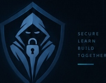

<div align="center">

  

  # 🛡️ CYBER CELL — SATI VIDISHA
  ### Official Cybersecurity Club • Central Coding Club Wing
  **Samrat Ashok Technological Institute (SATI), Vidisha (M.P.), India**

  <p align="center">
    <i>"Think Secure. Build Better."</i>
  </p>

  [](https://cyber-cell.vercel.app)
  [](https://github.com/cybercellsati/Cyber-Cell)
  [](https://nextjs.org)
  [](https://www.typescriptlang.org)
  [](https://tailwindcss.com)
  [](https://firebase.google.com)

  <br />

  [🌐 Explore Live Website](https://cyber-cell.vercel.app) • [👥 Meet the Team](https://cyber-cell.vercel.app/team) • [🎯 8 Core Domains](https://cyber-cell.vercel.app/domains) • [🗺️ 9-Stage Roadmap](https://cyber-cell.vercel.app#roadmap) • [📥 Join Offline](https://cyber-cell.vercel.app/join)

</div>

---

## 📌 Table of Contents

- [Overview](#-overview)
- [Key Features](#-key-features)
- [8 Security Focus Domains](#-8-security-focus-domains)
- [Interactive Web Terminal](#-interactive-web-terminal)
- [9-Stage Student Learning Roadmap](#-9-stage-student-learning-roadmap)
- [Leadership & Governance](#-leadership--governance)
- [Tech Stack & Architecture](#-tech-stack--architecture)
- [Project Directory Structure](#-project-directory-structure)
- [Getting Started Locally](#-getting-started-locally)
- [Environment Variables](#-environment-variables)
- [Production Deployment](#-production-deployment)
- [Recruitment & Membership](#-recruitment--membership)
- [Contributing](#-contributing)
- [License & Acknowledgements](#-license--acknowledgements)

---

## 🌐 Overview

**Cyber Cell** is the premier student cybersecurity body and ethical defense initiative established under the **Central Coding Club** at **Samrat Ashok Technological Institute (SATI), Vidisha**. 

Our mission is to bridge academia and defensive/offensive engineering, providing students with structured, hands-on learning pipelines in ethical hacking, network defense, digital forensics, reverse engineering, and collegiate CTF (Capture The Flag) competitions.

```
       ┌────────────────────────────────────────────────────────┐
       │          CENTRAL CODING CLUB — SATI VIDISHA            │
       └──────────────────────────┬─────────────────────────────┘
                                  │
                                  ▼
       ┌────────────────────────────────────────────────────────┐
       │             CYBER CELL CORE INITIATIVE                 │
       │                                                        │
       │  [ Faculty Advisory ] ── Prof. Shivangi Jain (CSE)     │
       │  [ Convenor & Founder ] ── Yash Harfode                │
       │  [ Co-Convenor ] ── Krishna Mishra                     │
       └──────────────────────────┬─────────────────────────────┘
                                  │
         ┌────────────────────────┼────────────────────────┐
         ▼                        ▼                        ▼
   [ Tech Ops ]           [ Media & Creative ]       [ Management ]
  Anubhav Vishwkarma       Abhishek Mahore            Ansh Kushwaha
  (Tech Team Head)         (Media Head)               (Management Head)
                           Arya Mishra                Medhavi Sharma
                           (Design Head)              (Docs & Outreach Head)
```

---

## ✨ Key Features

| Feature | Description |
| :--- | :--- |
| **💻 Interactive Web CLI** | Built-in simulated educational Unix terminal supporting commands like `about`, `domains`, `roadmap`, `team`, `flag`, and `clear`. |
| **🛡️ 8 Deep Security Domains** | Curated syllabi, tools, industry frameworks (OWASP, MITRE ATT&CK, NIST), and practical prerequisites. |
| **🗺️ 9-Stage Student Roadmap** | Progressive path from Computer Fundamentals and Networking to Offensive CTFs and Career Specialization. |
| **📚 Curated Resource Vault** | Verified learning links for PortSwigger Academy, TryHackMe, OverTheWire Bandit, Linux Journey, and MITRE. |
| **🔐 Role-Based Auth (Firebase)** | Clean user authentication supporting member and student profiles with Firebase Auth. |
| **👥 Institutional Team Directory** | Official roster featuring Faculty Advisory, Founder & Convenor, Executive Committee, and Core Department Heads. |
| **📢 Offline Recruitment Guide** | Transparent multi-round on-campus induction process replacing online forms with physical evaluation. |
| **⚡ Edge-Optimized Next.js 16** | Next.js App Router with Turbopack, Tailwind CSS 4, and instant page rendering. |

---

## 🎯 8 Security Focus Domains

```
┌─────────────────────────────────────────────────────────────────────────┐
│                     CYBER CELL SECURITY DOMAINS                         │
├──────────────────────────┬──────────────────────────┬───────────────────┤
│ 01. Ethical Hacking      │ 02. Network Security     │ 03. Web Security  │
│ Penetration testing,     │ Packet analysis, Wireshark,│ OWASP Top 10,  │
│ vulnerability assessment,│ firewalls, IDS/IPS, VPNs │ XSS, SQLi, CSRF,  │
│ privilege escalation     │ & network architecture   │ authentication    │
├──────────────────────────┼──────────────────────────┼───────────────────┤
│ 04. Malware Analysis     │ 05. Digital Forensics    │ 06. CTFs & Labs   │
│ Static/dynamic triage,   │ Autopsy, Volatility, disk│ Jeopardy & Attack-│
│ Ghidra, x64dbg, sandboxing│ image analysis, timeline│ Defense, crypto,  │
│ & behavioral tracking    │ reconstruction           │ stego, pwn, web   │
├──────────────────────────┴──────────────────────────┴───────────────────┤
│ 07. Security Awareness & Campus Defense                                 │
│ Anti-phishing drives, campus hygiene workshops & threat briefings       │
├─────────────────────────────────────────────────────────────────────────┤
│ 08. Career, Certifications & DevSecOps                                  │
│ CEH, OSCP, CompTIA Security+, SecOps pipelines, compliance standards    │
└─────────────────────────────────────────────────────────────────────────┘
```

---

## 💻 Interactive Web Terminal

Visitors can interact with our simulated terminal directly on the homepage:

```bash
$ help
Available simulated commands:
  about     : Learn about Cyber Cell SATI
  domains   : Explore 8 core security domains
  events    : View official event status
  team      : View organizational structure
  roadmap   : View 9-stage student roadmap
  resources : Inspect verified learning links
  flag      : Discover the hidden flag
  clear     : Clear terminal screen

$ flag
FLAG FOUND: CYBER{THINK_SECURE_BUILD_BETTER}
```

---

## 🗺️ 9-Stage Student Learning Roadmap


1. **Computer Fundamentals**: Architecture, OS internals, processes, threads, memory layouts.
2. **Computer Networks**: OSI Model, TCP/IP, DNS, DHCP, routing, subnets, packet structures.
3. **Linux & CLI**: Filesystem hierarchy, permissions, process management, shell pipelines, bash scripting.
4. **Programming**: Python for security scripts, sockets, regex, data structures, Bash automation.
5. **Web Architecture**: HTTP/HTTPS, REST APIs, headers, cookies, sessions, browser DOM, backend flows.
6. **Cybersecurity Foundations**: CIA triad, cryptography basics, hashing, symmetric/asymmetric ciphers, threat modeling.
7. **Hands-on Security Labs**: Nmap, Wireshark, Burp Suite, Metasploit, PortSwigger Web Security Academy.
8. **CTFs & Wargames**: OverTheWire Bandit, PicoCTF, TryHackMe rooms, HackTheBox machines.
9. **Specialization**: Cloud Security, Reverse Engineering, Red Teaming, Digital Forensics, DevSecOps.

---

## 👥 Leadership & Governance

### Faculty Advisory
* **Prof. Shivangi Jain** — *Faculty Advisor & Mentor*
  - Department of Computer Science & Engineering, SATI Vidisha
  - Institutional compliance, ethics, academic guidance, and student research mentorship

### Leadership & Executive Committee
* **Yash Harfode** — *Founder & Convenor*
  - Spearheads the club's strategy, technical curriculum, community, and training tracks
* **Krishna Mishra** — *Co-Convenor*
  - Club operations, cross-domain coordination, logistics, and student affairs

### Core Operations Heads
* **Anubhav Vishwkarma** — *Tech Team Head* (Infrastructure, CTF platforms, developer resources)
* **Abhishek Mahore** — *Media & Photography Head* (Media production, documentation, visual coverage)
* **Arya Mishra** — *Graphic Designer Head* (Brand identity, UI/UX, promotional graphics)
* **Ansh Kushwaha** — *Management & Volunteers Head* (Event coordination, venue, volunteer squads)
* **Medhavi Sharma** — *Documentation & Anchoring Head* (Reports, stage anchoring, student liaison)

---

## 🛠️ Tech Stack & Architecture

```
┌────────────────────────────────────────────────────────┐
│                      FRONTEND LAYER                    │
│   Next.js 16 (Turbopack) • React 19 • Tailwind CSS 4   │
│   Lucide Icons • Geist & Geist Mono Typography        │
└──────────────────────────┬─────────────────────────────┘
                           │
                           ▼
┌────────────────────────────────────────────────────────┐
│                   DATA & IDENTITY LAYER                │
│   Firebase v12 • Firebase Authentication • Firestore   │
│   Local Config Fallbacks • Zero-Crash SSR Safety       │
└──────────────────────────┬─────────────────────────────┘
                           │
                           ▼
┌────────────────────────────────────────────────────────┐
│                   INFRASTRUCTURE LAYER                 │
│   Vercel Edge Network • vercel.json Framework Pinning │
│   Automatic CI/CD from GitHub Main Branch              │
└────────────────────────────────────────────────────────┘
```

- **Frontend Core**: Next.js `16.3.4` (App Router) with React `19.2.8`
- **Styling**: Tailwind CSS `v4` with `@tailwindcss/postcss`
- **Design Language**: Cyber dark theme (`#06080d`), neon cyan accents (`#00e5ff`), frosted glassmorphism
- **Authentication & Database**: Firebase Auth & Cloud Firestore
- **Icons**: Lucide React
- **Deployment**: Vercel Global Edge Network with continuous GitHub integration

---

## 📂 Project Directory Structure

```text
Cyber-Cell/
├── app/
│   ├── about/             # About Cyber Cell & SATI Coding Club
│   ├── domains/           # 8 Cybersecurity Focus Domain syllabi
│   ├── events/            # Official events, workshops & status
│   ├── join/              # Offline induction guide & recruitment process
│   ├── projects/          # Open-source tools & defensive scripts
│   ├── resources/         # Verified external security learning vault
│   ├── team/              # Leadership, Advisory & Core Operations roster
│   ├── not-found.tsx      # Custom cyber-themed 404 handler
│   ├── layout.tsx         # Root layout with fonts, AuthProvider & modals
│   ├── page.tsx           # Landing hero, stats, interactive shell & roadmap
│   └── globals.css        # Tailwind CSS 4 theme rules & animations
├── components/
│   ├── AuthModal.tsx      # Sign in / Register popup modal
│   ├── CyberShieldLogo.tsx# Vector SVG brand logo badge
│   ├── Footer.tsx         # Site footer with disclaimer & social links
│   ├── Navbar.tsx         # Floating pill navigation with auth pill
│   └── TerminalDemo.tsx   # Interactive client-side simulated CLI
├── context/
│   └── AuthContext.tsx    # Firebase authentication context provider
├── data/
│   ├── domains.ts         # Domain datasets, syllabi & toolchains
│   ├── resources.ts       # Curated resource links by category
│   └── team.ts            # Faculty advisor, leadership & core heads data
├── lib/
│   └── firebase.ts        # Resilient Firebase client initialization
├── public/
│   └── images/            # Shield logos, badges & member avatars
├── vercel.json            # Framework preset configuration (Next.js)
├── next.config.ts         # Next.js configuration
├── package.json           # Node dependencies & build scripts
└── tsconfig.json          # TypeScript compiler configuration
```

---

## 🚀 Getting Started Locally

### Prerequisites
- **Node.js**: `v20.x` or `v22.x` / `v24.x`
- **npm**: `v9.x`+ or `pnpm` / `yarn` / `bun`
- **Git**

### 1. Clone the Repository
```bash
git clone https://github.com/cybercellsati/Cyber-Cell.git
cd Cyber-Cell
```

### 2. Install Dependencies
```bash
npm install
```

### 3. Setup Environment Variables
Copy the sample environment file and configure your Firebase credentials (optional for UI browsing, required for full Auth):
```bash
cp .env.example .env.local
```

### 4. Launch Development Server
```bash
npm run dev
```

Open [http://localhost:3000](http://localhost:3000) in your browser.

### 5. Build for Production
```bash
npm run build
npm run start
```

---

## 🔑 Environment Variables

The project features safe fallback mocks so it builds and runs even without Firebase keys. To enable live Firebase authentication and Firestore user profiles, provide:

| Variable | Description | Example |
| :--- | :--- | :--- |
| `NEXT_PUBLIC_FIREBASE_API_KEY` | Firebase Web API Key | `AIzaSy...` |
| `NEXT_PUBLIC_FIREBASE_AUTH_DOMAIN` | Firebase Auth Domain | `cyber-cell-d0258.firebaseapp.com` |
| `NEXT_PUBLIC_FIREBASE_PROJECT_ID` | Google Cloud Project ID | `cyber-cell-d0258` |
| `NEXT_PUBLIC_FIREBASE_STORAGE_BUCKET`| Cloud Storage Bucket | `cyber-cell-d0258.firebasestorage.app` |
| `NEXT_PUBLIC_FIREBASE_MESSAGING_SENDER_ID`| FCM Sender ID | `100344904262` |
| `NEXT_PUBLIC_FIREBASE_APP_ID` | Firebase Web App ID | `1:100344904262:web:...` |

---

## ☁️ Production Deployment

The project is configured for continuous zero-downtime deployment on **Vercel**:

- Pushes to branch `main` automatically build and deploy to **[https://cyber-cell.vercel.app](https://cyber-cell.vercel.app)**.
- `vercel.json` ensures the framework preset is locked to `nextjs`.
- All 8 routes are prerendered as high-performance static content:
  - `/` (Home)
  - `/about`
  - `/domains`
  - `/events`
  - `/join`
  - `/projects`
  - `/resources`
  - `/team`
  - `/_not-found`

---

## 📢 Recruitment & Membership

> [!NOTE]
> Cyber Cell does **NOT** conduct online student intake forms. Inductions are held exclusively **offline on-campus at SATI Vidisha** to ensure fairness, technical passion, and personal evaluation.

### On-Campus Selection Rounds:
1. **Round 1 — Aptitude & Cybersecurity Fundamentals**: Multiple choice + short technical scenario questions.
2. **Round 2 — Practical Problem Solving**: Hands-on Linux/Networking or domain task (for technical applicants).
3. **Round 3 — Personal Interview & Alignment**: Discussion with Faculty Advisory and Core Committee.

For complete offline induction schedules and venue guidelines, visit [/join](https://cyber-cell.vercel.app/join).

---

## 🤝 Contributing

Contributions to open-source labs, syllabi, educational writeups, and CTF challenges are always welcome!

1. Fork the repository
2. Create your feature branch (`git checkout -b feature/AddSecurityResource`)
3. Commit your changes (`git commit -m 'feat: add digital forensics cheat-sheet'`)
4. Push to the branch (`git push origin feature/AddSecurityResource`)
5. Open a Pull Request

---

## 📜 License & Acknowledgements

This project is open-source under the [MIT License](LICENSE).

- **Institution**: [Samrat Ashok Technological Institute (SATI), Vidisha](https://www.satiengg.in)
- **Parent Body**: Central Coding Club, SATI Vidisha
- **Leadership**: Yash Harfode (Founder & Convenor), Prof. Shivangi Jain (Faculty Advisor), Krishna Mishra (Co-Convenor)

<div align="center">
  <sub>Built with ❤️ and security in mind by the Cyber Cell Technical Team at SATI Vidisha.</sub><br />
  <b>© 2026 Cyber Cell. All rights reserved.</b>
</div>
